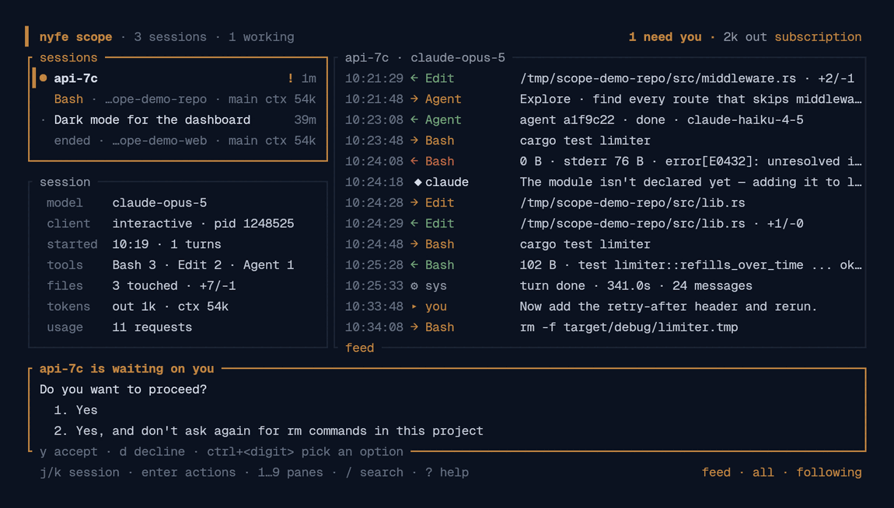
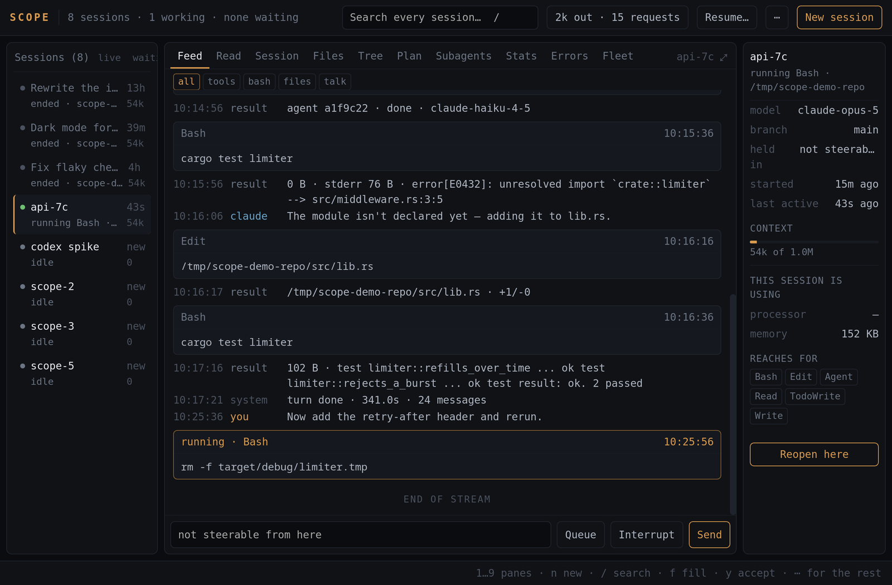
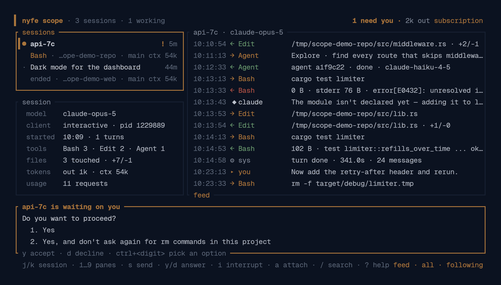
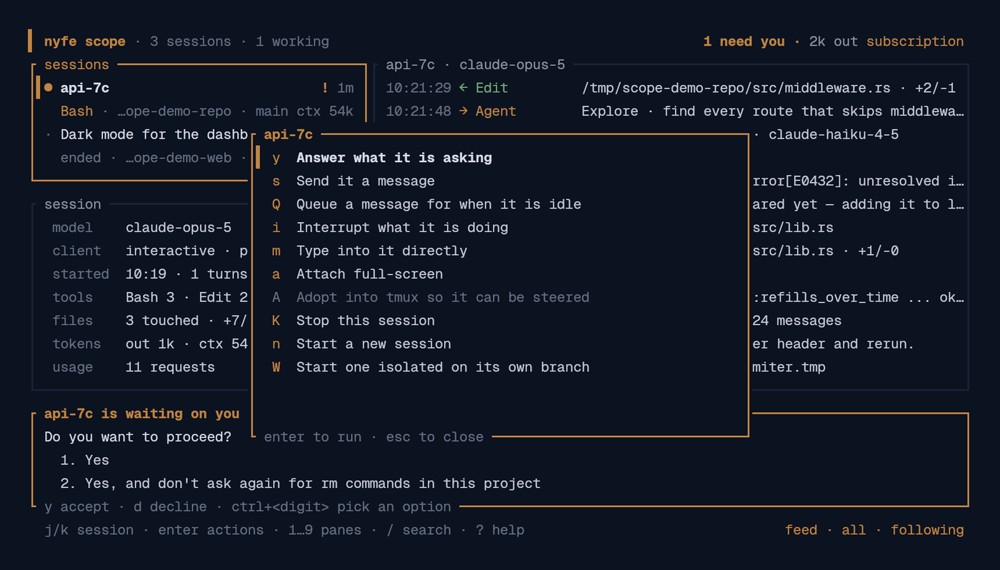
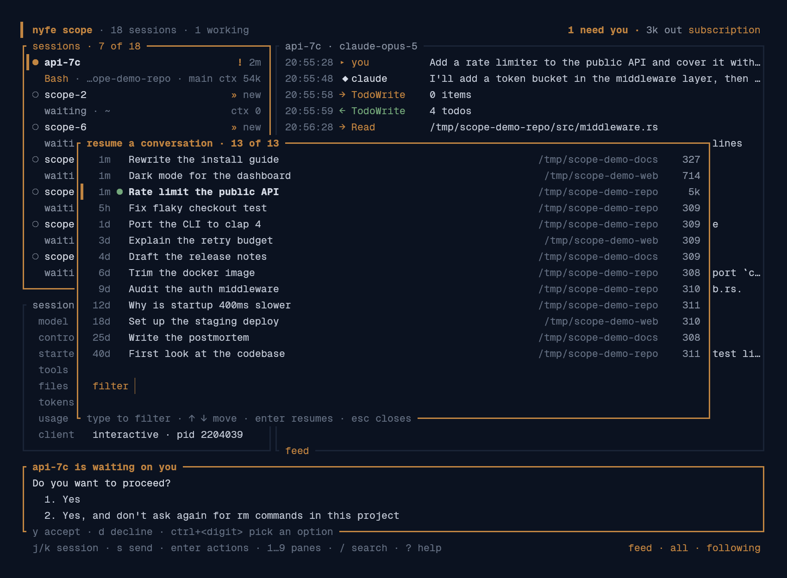
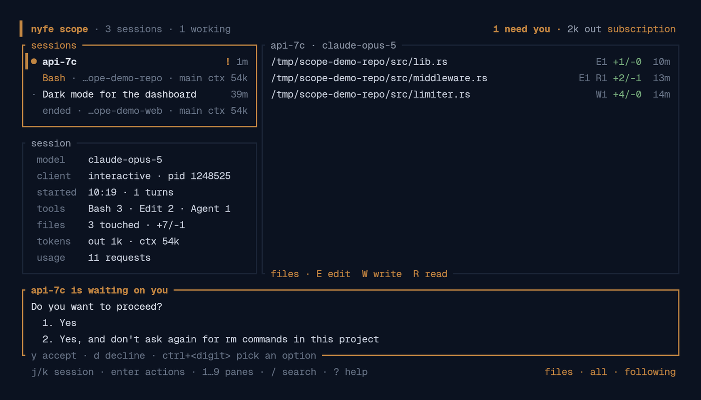
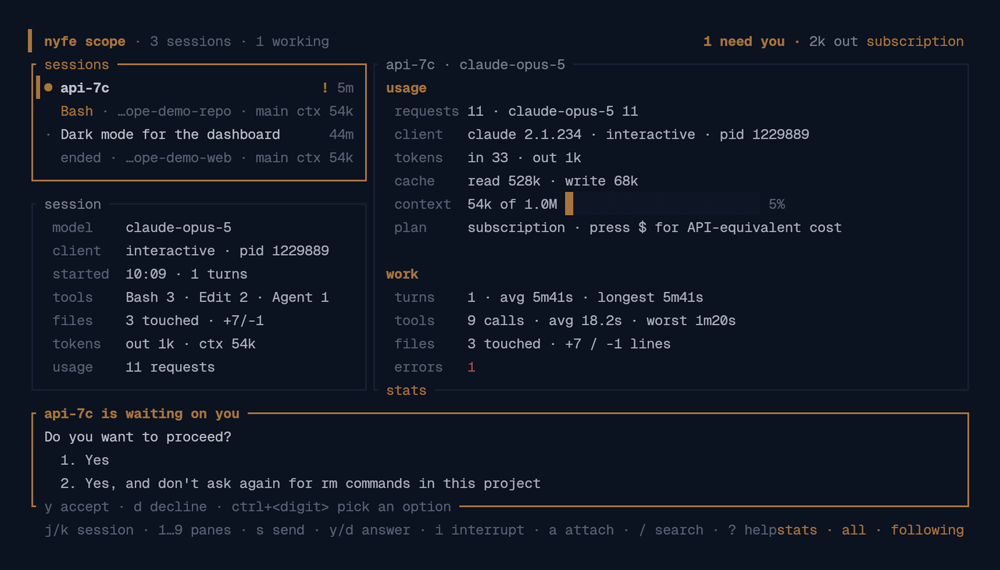

# Ironsight

**Never miss the Claude Code session that is waiting on you.**



The same thing as a desktop app, for anyone who would rather click than type:



Run three or four Claude Code sessions at once and the bottleneck is never the
model — it is the session sitting on a permission prompt in a window you are not
looking at. Ironsight watches every session on the machine, puts the blocked one at
the top, and lets you answer it without leaving the window. Then, when you want
the detail, it has everything the transcripts know: every file touched, every
diff, every subagent, every error.

No hooks to install, no server, no configuration, nothing leaves the machine.

## Install

```sh
curl -fsSL https://raw.githubusercontent.com/nyfeblade/ironsight/master/install.sh | sh
```

Or, if you would rather not pipe a script into a shell — it is short, read it
first — grab a binary from [releases](https://github.com/nyfeblade/ironsight/releases),
or build it:

```sh
cargo install --git https://github.com/nyfeblade/ironsight
```

As a desktop app on Linux, one file, nothing installed:

```sh
scripts/appimage.sh            # builds dist/ironsight-<version>-x86_64.AppImage
```

Clicking it opens the app. The same file is also the terminal view —
`./ironsight-0.4.1-x86_64.AppImage --tui` runs it in the shell you started it from,
and any other argument goes there too, so `--once` and `doctor` work from it as
well. `scripts/desktop-entry.sh` puts it in your application menu instead, if you
would rather run it from a checkout. The app needs webkit2gtk on the host, which
a normal desktop already has.

On Windows:

```powershell
irm https://raw.githubusercontent.com/nyfeblade/ironsight/master/install.ps1 | iex
```

Then run `ironsight`. Linux, macOS and Windows. On Linux and macOS tmux is optional,
and only needed to steer sessions rather than watch them.

### What runs where

The terminal view runs on all three. Linux and macOS steer sessions through
tmux, so a session outlives Ironsight; Windows has no tmux, so Ironsight hosts the
session itself and it ends when Ironsight does.

The desktop app is built and tested on Linux. It compiles for macOS and Windows
and the bundle knows how to make a `.app`, a `.dmg` and an installer, but no
release ships them yet and nobody has run it there — so treat those as untested
rather than supported.

One measurement differs by platform. What a session costs in memory is read from
proportional set size, which only Linux keeps: pages shared between an agent and
the processes it spawned are counted once. Elsewhere that figure does not exist,
and summing resident size would count every shared page once per process — so
what is reported is the agent's own resident size, which undercounts rather than
inventing a number several times too large.

## The session waiting on you



A session blocked on a prompt is the only state that cannot make progress on its
own, so Ironsight treats it as the most important thing on screen: blocked sessions
sort to the top, the header counts them, and the question with its options
appears at the bottom of the window wherever you are.

- `y` accepts, `d` declines, `ctrl`+digit picks any other option
- `p` jumps to the next session waiting
- `N` turns on desktop notifications, which also fire when a session goes idle
  or hits an error

It works by reading the rendered pane, so it handles any prompt Claude Code
draws — permission requests, trust prompts, plan approvals — without depending
on internals that can change.

From a script, without opening the UI:

```sh
ironsight waiting              # what is blocked, and what it is asking
ironsight approve api-7c       # answer it (option 1 by default)
ironsight adopt nyfe-32        # (re)open a conversation in tmux so it can be steered
ironsight prune                # close Ironsight sessions whose process has exited
ironsight owned                # the sessions Ironsight is holding itself
```

## Managing sessions

Press `enter` on a session and Ironsight shows everything you can do to it, with the
reason spelled out for anything it cannot do — so nothing has to be memorised
and no key is a dead end.



Sessions running in a tmux pane can be driven exactly as you would drive them by
hand, which keeps slash commands, permission prompts and plan mode working. The
same actions have direct keys once you know them:

| key | does |
|---|---|
| `s` | type a message into the selected session |
| `b` | send one message to every steerable session |
| `Q` | queue a message; it is delivered when that session next goes idle |
| | sending to a busy session says so, rather than looking delivered |
| `i` | interrupt (sends Escape) |
| `m` | passthrough — every key goes to the session until `ctrl+]` or `F12` |
| `a` `O` | show it full-screen · open it in its own window |
| `n` `A` | start a new session · adopt a running one, or reopen a stopped one |
| `R` | resume any conversation on this machine, however old |
| `W` | start one on its own branch in its own checkout |
| `M` `X` | merge that branch back · remove the checkout |
| `x` `P` | close the session · tidy up finished Ironsight sessions |
| `F2` | rename the selected session |
| `Z` | close everything Ironsight started (each one reopens with `A`) |
| `L` | launch a whole fleet from a config file |

`F12` always means back to Ironsight: out of passthrough, out of a session shown
full-screen, and out of one opened in its own window. The session's own status
line says so while you are in it. tmux's prefix-then-letter still works, but
knowing tmux should not be the price of looking at a session.

The key is held for as long as Ironsight is running and given back when it exits,
and it is only taken when nothing else has it — tmux key tables belong to the
whole server, so a key you have already bound stays yours and Ironsight tells you
the tmux way instead. If something outside tmux eats F12 first, which a
drop-down terminal often does, name another one: `IRONSIGHT_WAY_BACK=F9 Ironsight`.

Sessions started outside tmux are fully visible but cannot be typed into; they
are marked, so it is always clear which is which. `A` moves one: it resumes the
same conversation inside tmux and closes the original window, so the
conversation continues in one place rather than two. It asks first, and it
immediately reopens the session in a fresh window, so nothing you were watching
disappears — `O` does the same for any session on demand.

### Resuming anything, ever

The session list is a window on now — what is running, and what ran recently
enough to still matter. `R` answers the other question: every conversation on
this machine, whenever it happened. Type to filter across titles and folders,
`enter` brings one back inside Ironsight, and the ones already open are marked so
you do not start a second client on the same conversation.



It reads only the head of each transcript — the title Claude Code gave it, where
it was held, how it opened — so browsing hundreds of conversations costs a
moment, not a minute.

### Starting one

`n` takes a folder and, after it, anything you would have put on the command
line: `~/api --model opus --effort high fix the failing tests`, plus `--agent`
to run something other than Claude Code and `--name` to skip being asked. Whatever is left
after the flags is the first thing the session is asked, unquoted, because
typing a message is the common case. `W` does the same on a fresh branch in its
own worktree.

### Other agents

Claude Code is what Ironsight grew around, and everything it knows about a session's
insides — the feed, files, cost, subagents, plans — comes from the transcript
and registry that only Claude Code writes. What generalises is the part that made
steering work at all: a session is a program in a terminal, and a terminal can be
read and typed into.

So `--agent` starts something else — `codex`, `gemini`, `aider`, or any command
you name — and it is a session like any other: watched on screen, typed into,
interrupted, given its own worktree, named, closed, reopened in a window. Only
the panes that read a transcript are missing, and it says so rather than showing
you empty ones.

```
~/api --agent codex --name refactor fix the auth tests
```

Aider is the one that keeps its record somewhere else — `.aider.chat.history.md`,
beside the code rather than in a central store — and Ironsight reads it, so an
Aider session shows what was asked, what came back, its model and what it cost,
the same as any other.

### Sessions Ironsight holds itself

Everything above watches a session running in a terminal. Ironsight can also
*hold* one: started by it, spoken to over Claude Code's structured JSON, with no
terminal in the way.

```sh
ironsight new ~/api --owned --task "make the auth tests pass"
ironsight owned                     # what is held, and what each is doing
ironsight send owned-1 "try the other approach"
ironsight stop owned-1
```

It is a session like any other — it appears in the list, it has a feed and files
and a cost, you talk to it in the window, and `--task` briefs it from the
project's constitution as its opening message. Two differences are worth knowing.
It outlives every window, because a process of Ironsight's own is holding it
rather than a terminal. And nothing can be asked of it mid-run: Claude Code in
this mode refuses a tool its settings do not allow rather than prompting, so what
it may do is settled when it starts, with the same `--permission-mode` a terminal
session takes. A refusal shows up as a permission answered by policy, so a
session getting nothing done says why.

### Naming and closing

`n` starts a session from anywhere — it is not something you reach through a
session you already have — and asks what to call it before it starts, because
naming it at birth is one line typed into it and naming it later is a second
command. `enter` skips.

`F2` renames the selected session. A running one is asked to rename itself —
`/rename` is a real command, so its own header, the registry and the transcript
all stay in step. One that has stopped has nobody to ask, so Ironsight writes the
same record Claude Code writes, and the name is there when the conversation is
reopened.

`x` closes a session, one key. It used to want the word "yes" typed, from when a
closed session was gone for good; it is not, so the only thing left to protect is
a turn in flight, and that is the only case that asks twice.

### Stopping is not losing

`A` is also the way back into a session that has stopped, whether you stopped it,
it crashed, or its terminal closed: the transcript is on disk, so it reopens in
tmux with its history and picks up where it left off. Anything Ironsight can see it
can get back to.

Because of that, nothing is closed on a guess. `P` tidies up only sessions with
no Claude Code process left anywhere in them — a pane sitting at a shell prompt
while a command runs below it is still working, and closing it would throw away a
turn nobody asked to end. When Ironsight cannot tell, it leaves the session alone and
says so.

### On Windows

Windows has no tmux, and no way to reach into a console another program owns, so
Ironsight is the terminal there: `n` starts Claude Code on a pseudo-console Ironsight
owns, and everything else — send, queue, interrupt, passthrough, approvals, the
mirror — works the same way it does on Unix, against the screen Ironsight keeps of
what the session drew.

Two differences follow from that, and both are visible in the UI rather than
hidden:

- Ironsight can only steer sessions it started. One started in another window is
  still watched in full; `A` reopens that conversation inside Ironsight, which is
  the way to take control of it.
- A hosted session ends when Ironsight does, because Ironsight is holding it. `q` says
  how many would stop and waits for a second `q`, and `A` brings any of them
  back afterwards. On Unix tmux holds the session instead, so it outlives Ironsight.

`a` shows a session full-screen: on Unix by attaching to tmux, on Windows by
drawing the mirror with every key going to the session — `ctrl+]` or `F12`
leaves.

### Isolated sessions

Several sessions working one repository will trample each other. `W` starts a
session on a fresh branch in its own git worktree, so each edits its own files
and commits its own history while your working tree stays untouched. The tree
pane shows how far ahead the branch is, `M` merges it back with `--no-ff`, `X`
removes the checkout. Worktrees live under
`~/.local/share/ironsight/worktrees/`, well away from the repository.

Merging refuses rather than guesses: if the repository is not on the base branch
it says so and does nothing, and a conflict is reported for you to resolve.

### Fleets

`~/.config/ironsight/fleet.json` describes sessions to start together, and `L`
launches all of them:

```json
[
  {"cwd": "~/api", "prompt": "run the test suite and fix what fails", "effort": "high"},
  {"cwd": "~/web", "model": "claude-opus-5", "permission_mode": "plan"},
  {"cwd": "~/api", "worktree": "refactor-auth", "prompt": "extract the auth middleware"}
]
```

## What it shows

Ten panes, on keys `1` to `9` and `0`. The mouse works too: click a session or
a row to select it, click again to open it, and the wheel scrolls. `--no-mouse`
turns capture off if you would rather keep the terminal's own text selection
(shift-drag usually still selects while capture is on).

| pane | what it is for |
|---|---|
| feed | every event as it happens — prompt, reply, tool call with its arguments, result with status. `enter` opens the whole thing: full command, full output, full diff |
| files | every file read, written or edited, with counts, lines added and removed, and each file's diff history |
| stats | requests by model, tokens, cache, context fill, turns, a tool histogram, tool latency, errors, and a per-minute activity strip |
| plan | the session's todo list as it stands, plus anything queued |
| agents | subagents it launched, with status, duration and their own output |
| mirror | what that session's terminal is showing right now |
| tree | the working directory as it stands: branch, changed files, diffs |
| errors | every failed tool call and API error in one list |
| fleet | every session on a single timeline |
| read | the conversation on its own — what was asked and answered, wrapped and readable, with the machinery left out |

`/` searches everything loaded across all sessions; `]` and `[` step the matches.





Other keys: `enter` on a session opens its actions, `j`/`k` select a session,
`J`/`K` move in the right pane, `f`
filters the feed, `g`/`G` jump to top or bottom, `l` hides sessions with no
running process, `r` rescans, `$` switches between the subscription view and an
API-equivalent cost estimate, `?` shows help, `q` quits — `esc` only dismisses.

## Cost, on a subscription

The default view shows requests and tokens, not dollars, because a subscription
is not billed per token. `$` switches to an estimate of what the same tokens
would have cost at API rates (input, output, cache reads at 0.1x, cache writes
at 1.25x for the five-minute TTL and 2x for the hour). It is a comparison, not a
bill. A `*` means a model with no known rate was seen; the rate table is a
snapshot and will drift.

## What it cannot show

Reasoning text. Claude Code requests thinking with display omitted, so the API
returns empty thinking blocks and empty is what reaches the disk. Across 7,885
thinking blocks on the machine this was built on, two had text, both from a
local non-Claude model. No transcript reader can show what was never written.
Everything else a session does is there in full.

## How it works

Two files Claude Code already writes.

- `~/.claude/projects/<project>/<session-id>.jsonl` — the transcript, appended
  line by line *while a turn is in flight*. Tailing it gives every prompt, tool
  call, result, token count, turn duration and error as they happen.
- `~/.claude/sessions/<pid>.json` — the live-session registry: pid, cwd, the
  name Claude Code derived, and a busy/idle status. A pid is believed only when
  its start time matches the one recorded, so a recycled pid never reads as a
  live session. Versions that do not write this file fall back to inferring
  activity from transcript recency.

`CLAUDE_CONFIG_DIR` is honoured; `--root` points at transcripts anywhere.

Steering needs the terminal the session is in, and that is the one part with two
implementations: tmux on Unix, a pseudo-console Ironsight owns on Windows. Both
answer the same two questions — what is on this session's screen, and take this
key — so everything above them is written once.

Both formats are Claude Code's own and undocumented, so they can change. Ironsight
parses defensively and says so in the footer when it meets a version it was not
built against or a transcript it cannot read, rather than quietly showing
figures that are wrong. It was built against Claude Code 2.1.x.

Read that as the maintenance promise it is: a Claude Code release can move a
field, rename a status or redraw a prompt, and when that happens Ironsight loses a
detail — a status that reads wrong, a prompt it no longer recognises — rather
than inventing one. If you meet that, open an issue with your Claude Code
version; the fix is usually a few lines. The same is true of the pane reading
behind approvals and passthrough, which works by looking at what a session has
drawn on screen.

## The app

The desktop app and the terminal view are two front ends over one engine. Opening
the app starts whatever holds sessions — the tmux server on Unix — before the
window is drawn, so the first thing you click does not wait for it, and it says
plainly what is missing rather than failing quietly: `ironsight doctor` prints the
same checks in a terminal.

Neither front end is allowed to grow logic the other needs. `crates/core` holds
everything that is not a way of looking at it, `crates/tui` is the terminal view,
`crates/gui` the app; sending a message, answering a prompt or reopening a
conversation is one implementation with two callers.

## Where it is going

`docs/PLATFORM.md` describes the layers Ironsight could grow — events, lineage,
verification, briefing, supervision — what already exists, and the rule that
keeps each one useful on its own. `docs/BUILD.md` is the working spec for each:
what it does, where it lives, and what would have to be true for it to count as
finished.

`docs/STATE.md` is the shorter, more perishable one: what works today, what is
built but not yet wired, and what would trip someone up if nobody said so.

Both of the first two are written to be argued with. Everything claimed to exist is checkable in
this repository; everything else is marked as a claim.

## Development

```sh
cargo build --release
cargo test                  # prompt parser and git worktree lifecycle
scripts/demo.sh             # a synthetic ~/.claude plus a session parked on a
                            # prompt, for screenshots and manual testing
```

`scripts/demo.sh` prints how to run against the fixture and how to tear it down.
Nothing in it touches your real sessions.

## License

MIT
